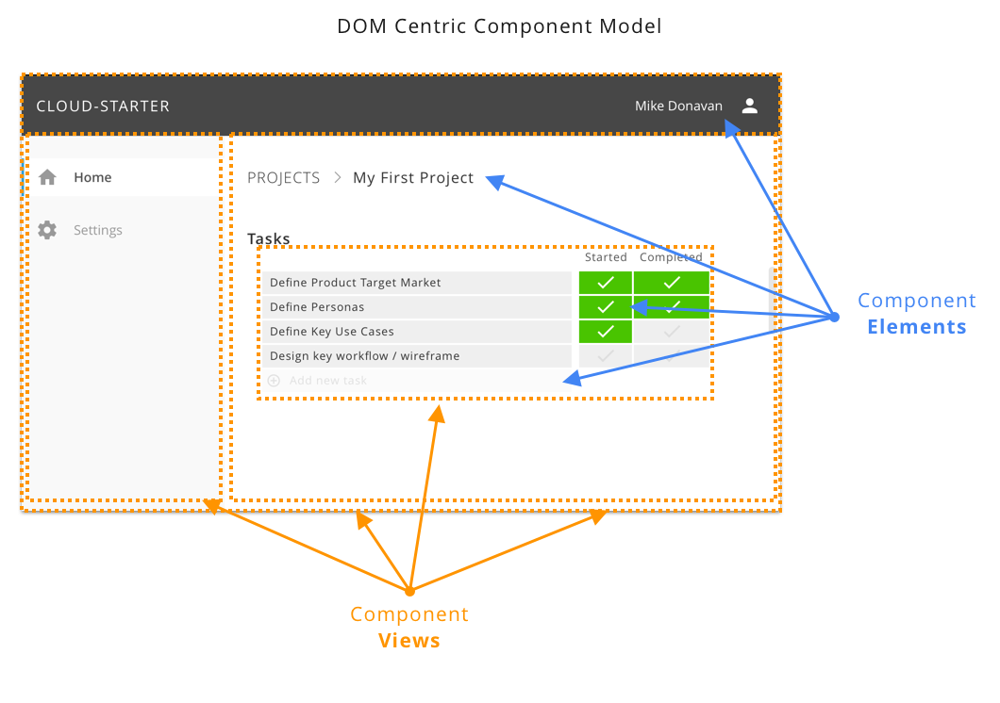

# Web UI Architecture & Patterns

### DOM Centric Approach

This DOM Centric approach consist in using the DOM as a foundation for a simple, robust, and scalable MVC model.

Components are split in two categories:

  - **Views** are bigger part of the UI which encapsulate most of the logic and styling at the functional level. Views have a fully asynchronous lifecycle and are responsible for all of the styling and application behaviors (e.g., create/update/delete data items). Views are managed by a DOM Centric micro-library, [mvdom (15kb min)](https://github.com/mvdom/mvdom), which provides a fully asynchronous lifecycle management without any DOM Abstraction, allowing Views to fully leverage the DOM Native eventing system.
  - **Elements** are smaller element from generic HTML Elements to customElements/WebComponents and are responsible for atomic functionalities, like a field-input, button, table cells, custom check boxes. Not all Component Elements have custom behavior, when they do, such behaviors can be implemented as event delegate on their parent view or document depending of their scope, and for more custom components, WebComponent customElements will be used. 

### Code Structure

All Web UI applications source code are structure the following way: 

- **services/web-server/web-folder** For each web application, we have a corresponding service (backend) web server with a _web-folder/_ which will be the output directory for the _js_ and _css_ files, as well as root _index.html_ files. 

- **frontends/web/** The _web_ client source code (.ts, .pcss, .tmpl) is located in the _frontends/_ folder structxure with the name of the web app (note: first one being often just 'web', hend the _frontends/web/_)

- UI code used **TypeScript (.ts)** for all logic code, **PostCSS (.pcss)** for all styling code, **Handlebars (.tmpl)** for most templating code beside inline templating for Custom Elements. TypeScript files will be processed by [Rollup](https://github.com/rollup/rollup) with the typing

- UI Code structure, below the **frontends/web/**, follows the following code layout:

  - **`src/_pcss/*.pcss`** Those are the base css files from mixins, CSS Vars, to base styling for the web applications. The folder is prefix by `_` so that it ran first by the postCSS processor without extra configuration.

  - **`src/ts/*.ts`** All of the main/base TypeScript files for the application level logic and cross view utilities (e.g., `main.ts` to start the app, `ajax.ts` for ajax wrapper, etc...)

  - **`src/views/**/*.[ts/pcss/tmpl]`** All of the views asset. By convention, each views have a `ViewName.ts` (logic/controller, always start with a `div.ViewName`), `ViewName.pcss` (style, scoped from `.ViewName`), and `ViewName.tmpl` (handlebars templates, prefixed with `ViewName-...` when multiple templates fror same view needed). 
    - Most views are organized in one level directory structured based on their names. 
    - View are names from generic-to-specific taxonomy to make the prefix match the folders and to be able to navigate code more effective. For example, `ProjectAddDialog.*` will be used over _AddProjectDialog.*_, which will usually be under a `src/views/Project/` folder.

  - **`src/web-components/*.[ts/pcss]`** All of the CustomElements/WebComponent (minus _shadowDOM_)

### Web Component (without _shadowDOM_)

With the deprecation of IE11 and move from Edge to Google Chrome, Native **WebComponents**, without heavy frameworks (e.g., Angular, React), are now a reality, and can be added to rich **DOM Centric** application development.

The trick, as with many technology/standard, is to know what is partical to use, and what is too dogmatic and add more complexity than value. 

- **YES: Custom Elements** is very robust should be used to efficiently componentized the application custom elements.

- **NOT YET: shadownDom** unfortunately _shadowDOM_ comes with great limitations and performance impact, specifically about its lack of support for global CSS sharing among components. The `::shadow` CSS Style piercing has been deprecated with no replacement, while inlining CSS Style in each custom component is a theoritical options, the performance cost as well as the complexity added for bigger app is not worthwhile the componentization protection it brings.  

- **Good News:** **Custom Elements without shadowDOM** (e.g., with direct children) brings most of the customization needed, with with the same best practices used in View styling, most of the drawbacks that _shadowDOM_ tries to aleviate are not really issue. 

See [frontends/web/src/web-components](../frontends/web/src/web-components/c-options.ts)

